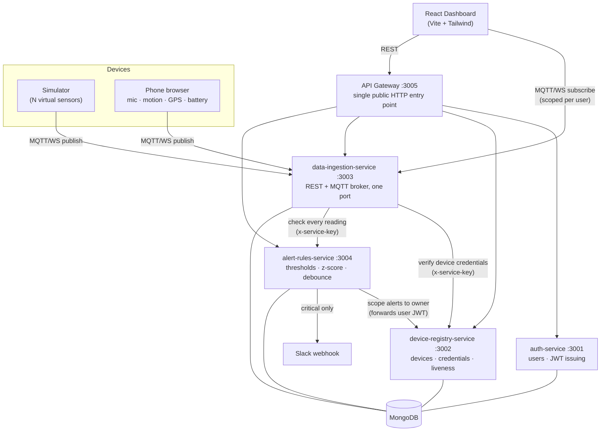

# IoT Telemetry Mesh

A distributed telemetry platform for IoT fleets: devices stream sensor readings over MQTT,
a rules engine watches for anomalies in real time, and a React dashboard shows live state
per device — with every user seeing only their own fleet.

Built as five independent Node services behind an API gateway, with an MQTT broker embedded
in the ingestion service. A browser-based node turns a real phone into a sensor, so the
system runs on genuine data rather than only simulated numbers.

---

## Architecture



**Data path for one reading:** device publishes to `telemetry/<deviceId>` → broker
authenticates the device and rejects any topic but its own → reading lands in an in-memory
ring buffer (live view) *and* is written to MongoDB (durable history) → forwarded to the
alert engine → the dashboard receives it over its own subscription, filtered to devices
that viewer owns.

---

## Stack

| Layer | Choice |
|---|---|
| Frontend | React 19, Vite, Tailwind CSS v4, React Router, Recharts |
| Backend | Node.js, Express — 5 independent services |
| Database | MongoDB + Mongoose |
| Messaging | MQTT over WebSockets ([aedes](https://github.com/moscajs/aedes) broker, embedded) |
| Auth | JWT (HS256) for users, bcrypt-hashed secrets for devices |
| Gateway | http-proxy-middleware |
| Infra | Docker + Docker Compose |
| Tests | Node's built-in test runner (`node --test`) |

---

## Design decisions

**Users and devices authenticate differently, on purpose.**
A person logs in and gets a short-lived JWT. A device gets a random 24-byte secret, stored
only as a bcrypt hash and returned in plaintext exactly once at issuance. Devices aren't
users — stretching one system to cover both would have meant either giving hardware
long-lived user tokens or inventing a "device user" that can log into the dashboard.

**JWT verification is stateless.**
Every service holds the same `JWT_SECRET` and verifies locally rather than calling back to
auth-service on each request. That removes auth-service from the hot path of every other
service. The tradeoff is real and deliberate: a token can't be revoked before it expires,
which is why expiry is short.

**REST and MQTT share one port.**
`data-ingestion-service` attaches a WebSocket server to the same HTTP server Express uses,
intercepting only the upgrade request. Most PaaS platforms expose exactly one port per
service, so a broker on its own port simply couldn't be deployed there.

**The live stream is scoped per viewer, separately from REST.**
REST scoping happens in device-registry (operators see their own devices, admins see the
fleet). The MQTT stream needed its own boundary: the dashboard subscribes to the wildcard
`telemetry/#`, so there's nothing per-device to allow or deny at subscribe time. Filtering
happens in `authorizeForward`, which runs per delivered message — the first point where the
specific device is known. Each connected viewer's allowed set is resolved at connect,
refreshed periodically, and **fails closed** if it can't be loaded.

**Ownership checks answer 404, never 403.**
Asking for a device that belongs to someone else returns exactly what asking for a device
that doesn't exist returns, so the API can't be used to enumerate device IDs.

**Liveness is derived from the data path, not self-reported.**
A device that is publishing is alive, so the ingestion service reports it seen (throttled to
once per 30s) rather than expecting devices to send a separate heartbeat. Nothing can claim
to be online while sending nothing, and it works for any client that reaches the broker —
including hardware that never speaks REST.

**Liveness is not authorization.**
Neither the liveness report nor the background sweep that marks quiet devices offline ever
writes anything but `isOnline`. Neither touches `status` — a timer, or a message from a
device, must not be able to make a decision that's gated to admins.

**Credential endpoints are rate limited per client IP.**
bcrypt makes every password guess expensive for the server too, so an unthrottled
`/login` is both a guessing oracle and a cheap way to pin the CPU. Only *failed*
attempts count, so signing in from several devices is fine while repeated wrong
passwords are throttled. The gateway forwards the real client IP as
`X-Forwarded-For` and auth-service trusts exactly one proxy hop — without both
halves the limiter would count every user into one bucket and lock out everybody.

**Anomaly detection runs only on real data.**
The rolling z-score detector is applied to sound levels from actual phone microphones.
Running it over simulator output would be finding patterns in numbers that were invented.

---

## Quick start

**Prerequisites:** Node.js 20+, and a MongoDB connection string (Atlas free tier is fine).

### 1. Configure

Every service reads its own `.env`. Copy each example and fill it in:

```bash
for d in services/*/ simulator dashboard; do cp "$d/.env.example" "$d/.env"; done
```

Then generate the two shared secrets **once** and paste the same values into every `.env`
that asks for them:

```bash
echo "JWT_SECRET=$(openssl rand -hex 32)"; echo "INTERNAL_SERVICE_KEY=$(openssl rand -hex 32)"
```

> `JWT_SECRET` must be byte-identical across all services — each one verifies tokens
> locally. A mismatch shows up as `Invalid token` on an otherwise valid login.

Set `MONGO_URI` in each of the four data-owning services (they can share one cluster).

For anything deployed, also set `CORS_ORIGIN` to your dashboard's URL. Left blank it allows
every origin — convenient across localhost and a phone on the LAN, but not something to ship.

### 2. Install and run

```bash
for d in services/*/ simulator dashboard; do (cd "$d" && npm install); done
```

Start each service in its own terminal (or use Docker Compose, below):

```bash
cd services/auth-service && npm start
```

…and the same for `device-registry-service`, `data-ingestion-service`,
`alert-rules-service`, `api-gateway`. Then:

```bash
cd dashboard && npm run dev
```

### 3. Create an account and start data flowing

```bash
curl -X POST http://localhost:3005/api/auth/register \
  -H 'Content-Type: application/json' \
  -d '{"username":"demo","password":"demo-password"}'
```

Put those credentials in `simulator/.env` as `SIM_USERNAME` / `SIM_PASSWORD`, then:

```bash
cd simulator && npm start
```

The simulator self-provisions: it logs in, registers its devices, issues their credentials,
caches them in `device-secrets.json` (gitignored, since a secret is only returned once), and
starts publishing. Log into the dashboard at `http://localhost:5173` and the fleet appears.

### With Docker Compose

```bash
docker compose up --build
```

Brings up all five services on the `iot-mesh` network. Only the gateway (`:3005`) and the
ingestion service (`:3003`, for MQTT/WebSocket) publish ports. MongoDB is still whatever
`MONGO_URI` points at — Compose doesn't run a local database.

### Deploying

`render.yaml` defines all six services as a Render Blueprint. See
**[DEPLOY.md](DEPLOY.md)** for the full walkthrough, including the shared-secret
setup and the two settings people most often get wrong.

### Streaming from a real phone

The `/mobile-node` page publishes live microphone level, motion, GPS and battery from a
phone browser. Browsers gate those sensors behind a secure context, so it needs HTTPS:
generate a certificate with [mkcert](https://github.com/FiloSottile/mkcert), point
`SSL_KEY_PATH` / `SSL_CERT_PATH` at it in the relevant `.env` files, and open the dev
server's network address on the phone.

---

## API

All routes are reached through the gateway at `:3005`. Everything except register/login
requires `Authorization: Bearer <token>`.

| Method | Route | Notes |
|---|---|---|
| `POST` | `/api/auth/register` | Always creates an `operator`; roles are never self-granted. Rate limited |
| `POST` | `/api/auth/login` | Returns a JWT. Rate limited per IP on failed attempts |
| `GET` | `/api/auth/me` | Current token's claims |
| `POST` | `/api/devices` | Register a device |
| `GET` | `/api/devices` | Your devices (admins: all) |
| `GET` | `/api/devices/:id` | 404 for devices you don't own |
| `PATCH` | `/api/devices/:id/status` | **admin only** — `pending` / `active` / `decommissioned` |
| `POST` | `/api/devices/:id/heartbeat` | Owner or admin. Optional — liveness is automatic |
| `POST` | `/api/devices/:id/credentials` | Issues a device secret — plaintext returned **once** |
| `GET` | `/api/telemetry/:id/recent` | Live ring buffer (empty after a restart) |
| `GET` | `/api/telemetry/:id/history` | Durable history from MongoDB — `?limit=&since=` |
| `GET` | `/api/alerts` | Recent alerts, scoped to your devices |

Two internal routes are gated by the shared `x-service-key` header rather than a user JWT,
because no logged-in human is involved: `POST /api/devices/:id/verify-credentials` (broker
checking a device's secret), `POST /api/devices/:id/seen` (ingestion marking a publishing
device alive) and `POST /api/alerts/check` (ingestion handing off a reading).

### MQTT

Connect over WebSockets to `ws://localhost:3003`.

| Client | Username | Password | Rights |
|---|---|---|---|
| Device | its `deviceId` | its issued secret | publish to `telemetry/<own id>` only |
| Dashboard | `dashboard` | the user's JWT | subscribe only; deliveries filtered to owned devices |

---

## Alerting

| Alert | Trigger |
|---|---|
| `high-temperature` | above `TEMP_THRESHOLD_C` (default 35°C) |
| `low-battery` | below `BATTERY_THRESHOLD_PCT` (default 20%) |
| `sound-anomaly` | more than `SOUND_Z_SCORE_THRESHOLD` σ above that device's own rolling baseline |
| `motion-shake` | acceleration magnitude above `MOTION_SHAKE_THRESHOLD` (default 25 m/s²) |

Every alert type is debounced per device (`ALERT_COOLDOWN_MS`, default 5 min) so one noisy
sensor fires once per sustained problem instead of once per reading. Critical alerts also
POST to `ALERT_WEBHOOK_URL` if one is configured.

---

## Tests

```bash
for d in services/*/; do (cd "$d" && npm test); done
```

```bash
cd dashboard && npm test
```

57 tests. The services use Node's built-in runner (no test framework dependency); the
dashboard uses Vitest. They cover the parts where a mistake is silent rather than loud: the
JWT middleware (including `alg:none` rejection and role gating), login rate limiting and its
per-IP keying, per-viewer MQTT delivery scoping, liveness reporting and its throttle, expired-session
handling in the API client,
ring-buffer eviction, the z-score detector's baseline behaviour, alert debouncing, and the
liveness sweep's refusal to touch `status`.

---

## Repository layout

```
services/
  api-gateway/              single public entry point, proxies to the four below
  auth-service/             users, password hashing, JWT issuing
  device-registry-service/  device lifecycle, device credentials, liveness sweep
  data-ingestion-service/   REST + embedded MQTT broker, ring buffer, persistence
  alert-rules-service/      threshold + z-score detection, debounce, webhooks
dashboard/                  React SPA — fleet view, live charts, phone sensor node
simulator/                  self-provisioning virtual device fleet
```
